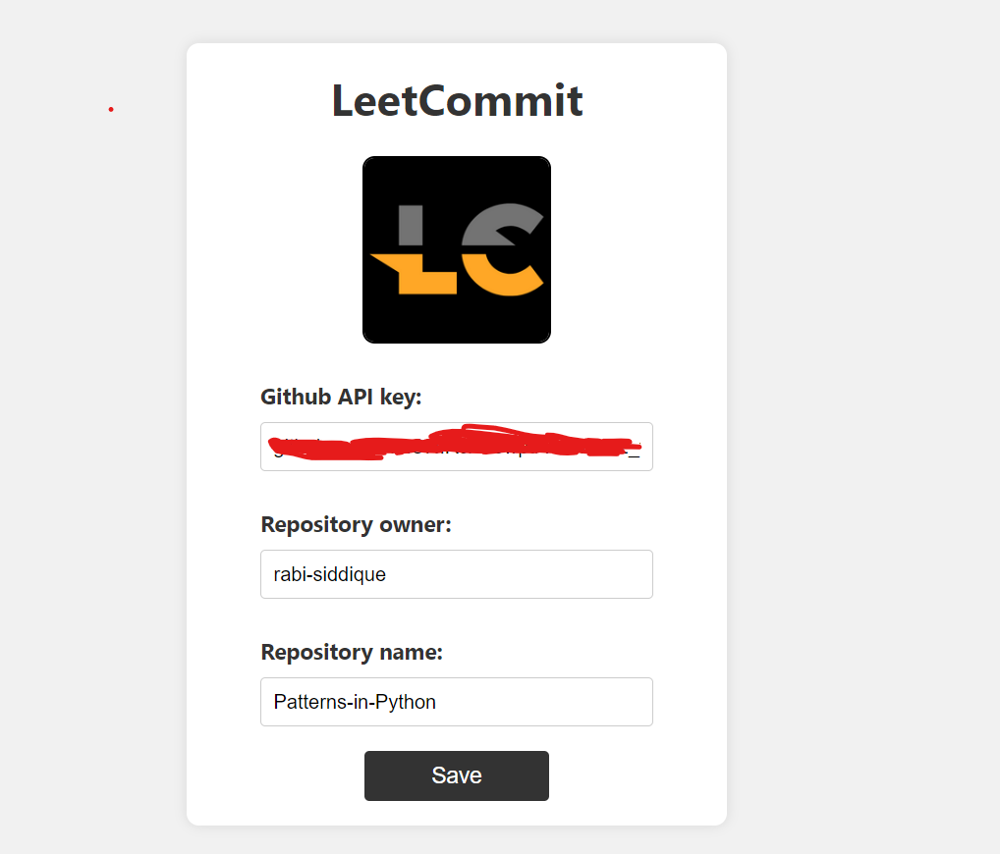
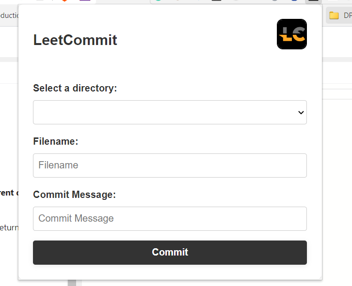

## LeetCommit

This is a browser extension that allows users to quickly commit their leetcode problem;s code to their GitHub repositories directly from their browser. The extension is compatible with most modern browsers, including Chrome, Firefox, and Safari.

** Note: This extension is currently in development and has a few bugs that need to be fixed before it can be uploaded to the Chrome Store. However, I am open to accepting pull requests from other developers who may want to contribute to the project. **

## Features

The extension allows users to:

- Quickly commit code to their GitHub repository from their browser
- Create files to commit
- Commit files in subdirectories in the root directory
- Enter a commit message

## ScreenShots

